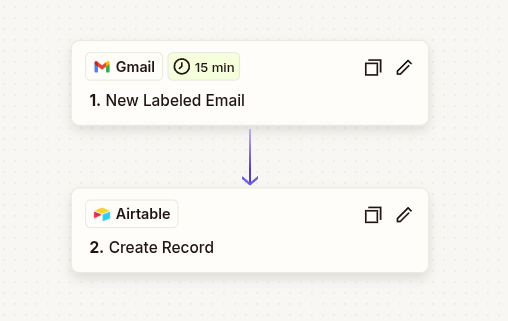

# 🏥 Healthcare AutoClaims — AI-Powered Health Receipt Tracker


> Never copy a healthcare invoice by hand again.

A fully automated pipeline that watches a Gmail inbox for healthcare receipts, extracts structured data from PDF invoices using GPT-4.1 mini, and builds a live reimbursement tracking database — with zero manual data entry on the intake side.

---

## The Problem

Managing health insurance claims means digging through emails, copying invoice details by hand, and tracking what's been reimbursed and what hasn't — across multiple patients, practitioners, and claim types. This project eliminates the intake friction entirely.

---

## Architecture & Data Flow

```
Gmail (auto-tagged emails)
         │
         ▼
   Zapier Trigger
   (New labeled email — "healthcare")
         │
         ├── email_link     → direct link back to source email
         └── attachment     → PDF invoice
         │
         ▼
   Airtable Record Created
         │
         ▼
   AI Assist (GPT-4.1 mini)
   structured extraction from PDF
         │
         ▼
   Formula Columns (Regex)
   one clean value per field
         │
         ▼
   Manual Columns
   claim tracking & reimbursement
```

---

## Step-by-Step Setup

### 1. Gmail — Label-Based Filtering

A Gmail filter automatically applies the label `healthcare` to incoming emails from healthcare providers. This label is the Zapier trigger.

**Example Gmail filter:**
```
From: (clinic@physio.ca OR invoices@dental.com OR ...)
Apply label: healthcare
```

---

### 2. Zapier — Automation Flow



| Step | App | Action |
|------|-----|--------|
| **Trigger** | Gmail | New email matching label `healthcare` |
| **Action** | Airtable | Create record with `email_link` + `attachment` |

Zapier fires every 15 minutes, captures the email link and PDF attachment, and creates a new Airtable record automatically.

---

### 3. Airtable — AI Extraction Field

An **AI Assist** column runs the following GPT-4.1 mini prompt against each attached invoice:

```
You are an expert information extraction assistant. Extract the following fields
from the provided invoice or insurance document. Output your extraction in the
exact format given below. If a field is not specified in the document, write
"not specified." Dates should be returned in yyyy-mm-dd format.

clinic_name: [the full name of the clinic]
patient_first_name: [patient's first name only]
type_of_care: [description of care provided]
appointment_date: [date of appointment, yyyy-mm-dd]
practitioner_name: [name of the practitioner who performed the service]
duration: [duration of service, if mentioned; otherwise, "not specified"]
amount_due: [amount billed to the patient for the care provided, including dollar
sign; if payment already made, return the original service amount only]

Use only information from the invoice — do not infer or use information from
outside sources.

Instructions for use:
- Give only the requested data fields in the output, nothing more.
- If there are multiple activities or practitioners, select the one associated
  with the primary service line (highest amount/rate or first listed).
- Do not hallucinate answers — return "not specified" if a value is missing.
```

**Example AI Assist output:**
```
clinic_name: Clinique Physiothérapie Montréal
patient_first_name: Michel
type_of_care: Chiro Adult
appointment_date: 2025-07-27
practitioner_name: Alfred D
duration: 60
amount_due: $50.00
```

---

### 4. Formula Columns — Regex Extraction

Each field is parsed out of the `AI Assist` column into its own clean, queryable cell.

#### `patient_first_name`
```
TRIM(
  MID(
    {AI assist},
    FIND("patient_first_name:", {AI assist}) + 19,
    FIND("type_of_care:", {AI assist}) - FIND("patient_first_name:", {AI assist}) - 19
  )
)
```

#### `practitioner_name`
```
REGEX_EXTRACT({AI assist}, "practitioner_name: ([^\n]+)")
```

#### `clinic_name`
```
TRIM(
  MID(
    {AI assist},
    FIND("clinic_name:", {AI assist}) + 12,
    FIND("patient_first_name:", {AI assist}) - FIND("clinic_name:", {AI assist}) - 12
  )
)
```

#### `type_of_service` — Category Mapping
Maps the raw extracted care type to a normalized insurance category:
```
IF(
  SEARCH(OR("psycho","Psychotherapy"), LOWER({Type of Care (Manual)})),
    "Mental Health",
    IF(
      SEARCH("optical", LOWER({Type of Care (Manual)})),
        "Optical",
        IF(
          SEARCH("dental", LOWER({Type of Care (Manual)})),
            "Dental",
            "Paramedical"
        )
    )
)
```

#### `duration` — Numeric Extraction with Fallback
Extracts duration in minutes; defaults to 60 if not specified:
```
IF(
  VALUE(REGEX_EXTRACT({AI assist}, "duration: ([^\n]+)")) = 0,
  60,
  VALUE(REGEX_EXTRACT({AI assist}, "duration: ([^\n]+)"))
)
```

#### `total_paid` — Amount as Number
Strips the `$` sign and returns a numeric value for calculations:
```
VALUE(REGEX_EXTRACT({AI assist}, "amount_due: \$?([\d\.]+)"))
```

---

### 5. Manual Columns — Claim Tracking

Once a claim is submitted to the insurer, four fields are updated manually to close the loop:

| Column | Type | Description |
|--------|------|-------------|
| `claim_id` | Text | Insurer's claim reference number |
| `claim_refund` | Currency | Amount reimbursed per claim line |
| `total_refund` | Currency | Total reimbursement if split across multiple payments |
| `% refund` | Formula | `total_refund / total_paid` — out-of-pocket ratio |

---

## Airtable Table Structure

| Column | Type | Source |
|--------|------|--------|
| `email_link` | URL | Zapier |
| `attachment` | Attachment | Zapier |
| `AI_assist` | AI Field | GPT-4.1 mini |
| `clinic_name` | Formula | Regex on `AI_assist` |
| `patient_first_name` | Formula | Regex on `AI_assist` |
| `type_of_care` | Formula | Regex on `AI_assist` |
| `type_of_service` | Formula | Category mapping on `type_of_care` |
| `appointment_date` | Formula | Regex on `AI_assist` |
| `practitioner_name` | Formula | Regex on `AI_assist` |
| `duration` | Formula | Regex on `AI_assist` with fallback |
| `total_paid` | Formula | Regex on `AI_assist` |
| `claim_id` | Text | Manual |
| `claim_refund` | Currency | Manual |
| `total_refund` | Currency | Manual |
| `% refund` | Formula | `total_refund / total_paid` |

---

## Key Design Decisions

**Why a structured prompt with fixed labels?**
Consistent key names like `clinic_name:` make regex extraction trivial and deterministic. The model is constrained to a predictable output format — parsing never breaks on unexpected phrasing.

**Why keep the raw AI output?**
The `AI_assist` column preserves the full model response. If the prompt is updated or a field needs re-extraction, only the formula changes — no re-running the Zap.

**Why a `type_of_service` category mapping?**
Insurance plans reimburse by category (Paramedical, Dental, Optical, Mental Health), not by raw care description. Normalizing at the formula level makes the table directly usable for claim submission without manual interpretation.

**Why default `duration` to 60?**
Most practitioners bill per session rather than per minute, and many invoices omit duration entirely. A 60-minute default avoids blank cells while remaining a neutral assumption.

**Why manual entry for reimbursement data?**
Claim reimbursements come from a separate insurer portal and often arrive days or weeks after submission. Keeping this manual preserves a clean separation between automated intake and human-confirmed financial data.

---

## Potential Extensions

- **Multi-patient support** — filter by `patient_first_name` for family tracking
- **Spending dashboard** — connect to Google Looker Studio or a Power BI report for monthly spend and reimbursement rate by category
- **Automated claim submission** — where insurer APIs are available
- **OCR fallback** — for scanned or image-based PDFs, add a pre-processing step via Google Cloud Vision before the AI field

---

*Built to eliminate the most tedious part of managing health benefits — so the only manual step left is the one that actually requires a human.*
